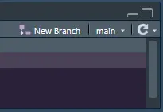
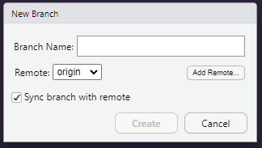

Advanced git
================

- [Overview][]
  - [Why Bother?][]
  - [Adding a File][]
  - [Create a Branch][]
  - [Modifying a Shared File][]
  - [Make a Pull Request][]

Member 1 Member 2
Member 3 Member 4

## Overview

For this worksheet we will be practicing using git/GitHub for
collaborative code development. We’ll be using your final project repo
as an example. Specifically, we will be adding all of your names to the
authors section, and dealing with the merge conflicts that will cause.

For this lab, assign each member a number 1-4 (or 3). I will refer to
steps “Member 1,” “Member
2,” etc. should take throughout this lab. Be sure not to skip
ahead or do steps out of order, or the problems you encounter won’t be
the ones I wrote this guide to help with.

To start with, have each team member open the R Studio project for your
final package and the page on GitHub of your repo.

### Why Bother?

Today we’ll be using git as a team for the first time. git requires you
to be *very* exact, and that can sometimes be tedious. However, git is
simply *the best* method to collaboratively code that is widely used. It
is used in business, government, research, and anywhere else significant
coding is happening. You need to understand these tools to be an
effective team member in the data science world.

Not only does using git to collaborate confer all the benefits of using
git alone–such as version control and backups–it will also make working
on the same code base *much* easier than alternative methods. Because
git tracks code files on a line-by-line basis, it is possible for
multiple people to work on the same files simultaneously with limited
possibility for issues.

Issues do still happen though, and today we will force some of those
issues so we can practice resolving them.

### Adding a File

To start, we are all going to add a new file to our project repo. You
can imagine this is any kind of file you would like–code, help files,
etc.–the process is the same. On each of your computers, create a new
folder called “scrap.” Make sure the name is all lower case, in the
folder is in the base directory of your project. Inside that folder,
create and save a new R Script which contains some `print()` statement.
It doesn’t matter what the statement says.

Confirm all members have **created**, **saved**, and **committed** this
file on their computers before moving on.

At this point Member 1 should push their
changes. This will add their file to the GitHub repo. Go look on your
project repo GitHub page to see the new folder and file appear. You will
need to refresh the page.

Now, Member 2 should try to push their changes.
They will get an error saying something along the following:

    ! [rejected]        HEAD -> main
    error: failed to push some refts to <YOUR REPO>
    hint: Updates were rejected because the remote contains work that you do
    hint: not have locally. This is usually caused by another repository pushing
    hint: to the same ref. You may want to first integrate the remote changes
    hint: (e.g. 'git pull ...') before pushing again.

This happens, as the hint says, because there are new files on GitHub
you do not have, so git won’t let you push. To resolve this, we can
follow the hint’s advice and do a pull. This will update your local
files with Member 1’s work, and now Member 2 should be able to push.

Repeat this process until all members have all other members’ files on
their computer.

### Create a Branch

In the previous section, we were creating files which we then pushed to
the `main` branch of our project. This is *not* good practice. You
should think of `main` as the canonical, pristine version of your code
base. Put simply, only things that have been examined and tested by
multiple team members should be included in `main`.

The proper way to conduct work on a shared project is within a *branch*.
Recall our branch diagram from class:

![[Git Branches - The Turing Way][]][1]

When you create a branch, you split your work off into a separate little
universe. No work you do here will change what `main` is like. This
means you can experiment on your branch, try things, even break things,
and everyone else can keep using the clean code on `main`.

To create a new branch, you can look to the upper right corner of the
*git* pane in R Studio. You’ll see a button that says “New Branch,”
click on that and you will see the following pop up.

<table>
<colgroup>
<col style="width: 50%" />
<col style="width: 50%" />
</colgroup>
<tbody>
<tr class="odd">
<td style="text-align: center;">

<figure>

<figcaption aria-hidden="true">New Branch Button</figcaption>
</figure>

</td>
<td style="text-align: center;">

<figure>

<figcaption aria-hidden="true">Branch Menu</figcaption>
</figure>

</td>
</tr>
</tbody>
</table>

### Modifying a Shared File

While working on separate files is fine, if you are working on a project
together, you probably want to be able to edit the *same* files. git is
great for this usually, but sometimes things can go wrong. We’re going
to practice this now.

Each member should open the `DESCRIPTION` file of their final project
repo in R Studio. You will notice there is a section called `Authors@R`.
Whatever is included here will be understood as the creators of this
package. We want to add each of your names. On each of your computers,
follow the template and add your first and last names, along with email
to the file.

### Make a Pull Request

Once you are happy with the work you’ve done on your branch, you can try
to *merge* your work into `main`. This will take your changes and make
it part of the canonical code that everyone will work from. The process
of merging your code is done through a *pull request* on GitHub; named
such because you request your changes to be pulled into main.

  [Overview]: #overview
  [Why Bother?]: #why-bother
  [Adding a File]: #adding-a-file
  [Create a Branch]: #create-a-branch
  [Modifying a Shared File]: #modifying-a-shared-file
  [Make a Pull Request]: #make-a-pull-request
  [Git Branches - The Turing Way]: https://the-turing-way.netlify.app/reproducible-research/vcs/vcs-git-branches.html
  [1]: ./img/sub-branch.png
